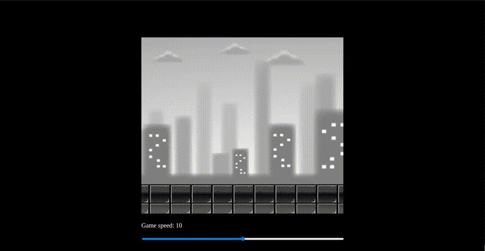
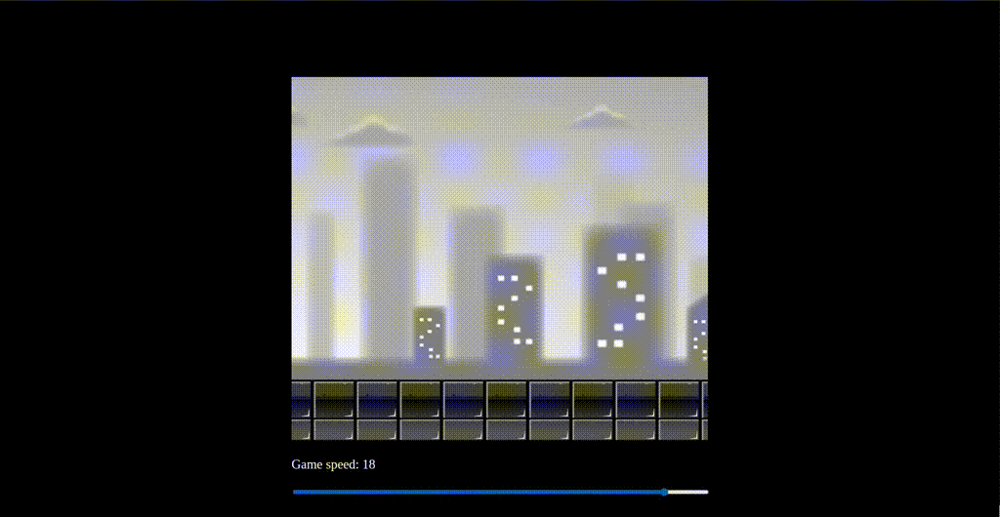

# Animación Parallax con JavaScript

Este proyecto utiliza la tecnología del lienzo HTML5 para crear una animación de paralaje, que consiste en mover múltiples capas de imágenes de fondo a diferentes velocidades. Esta técnica se logra mediante el uso de la clase Layer, que representa cada una de las capas y controla su posición y velocidad de desplazamiento en el lienzo.

El ciclo de animación se maneja con el método requestAnimationFrame, lo que garantiza una actualización suave y eficiente de la pantalla. Además, se incluye un control deslizante interactivo para ajustar la velocidad de la animación en tiempo real, lo que permite a los usuarios personalizar su experiencia de visualización.

## Características

- **Selección de Velocidad:** Al cargar la página web, verás un deslizador etiquetado como "Velocidad del Juego". Este deslizador controla la velocidad de la animación. Ajusta el deslizador para cambiar la velocidad de la animación.

## Demostración en GIF

## Instrucciones de Uso

1. Clona o descarga el repositorio.
2. Abre el archivo `index.html` en tu navegador para visualizar las animaciones.

## Notas Adicionales

- Para obtener más detalles sobre cada sección, consulta el video tutorial https://www.youtube.com/watch?v=Mg7ibYWhjPI&t=1534s&ab_channel=Frankslaboratory

---
